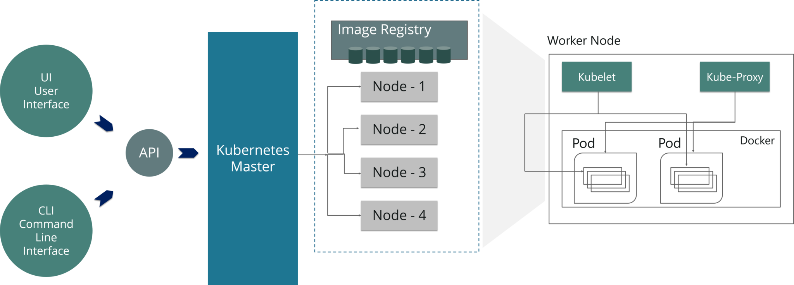

# Introduction
This tutorial shows you how to build and deploy a simple, multi-tier web application using Kubernetes and Docker. This example consists of the following components:

- A single-instance Redis master to store guestbook entries
- Multiple replicated Redis instances to serve reads
- Multiple web frontend instances <br><br>

# Kubernetes Basics
Why is K8s so in demand? Kubernetes makes it easier for you to automatically scale your app, reduce downtime, and increase security. No more writing scripts to check, restart, and change the number of Docker containers. Instead, you tell K8s your desired number of containers and it does the work for you. K8s can even automatically scale your containers based on resources used.
Kubernetes is all about abstracting away complexity. It provides clear points to interface with your app’s development environment.
K8s doesn’t make a lot of sense for a basic static website that gets a handful of visitors per day. Its use case is for larger apps that might have to scale up and down quickly.
For large apps, you can use K8s to get the most out of your compute and storage resources. When paired with cloud providers, K8s can save you money. No matter where you run K8s, it should help you save time and reduce DevOps headaches.
<br>
<br>




## **Master Components**
Master components provide the cluster’s control plane. Master components make global decisions about the cluster (for example, scheduling), and they detect and respond to cluster events.

#### kube-apiserver <br>
Component on the master that exposes the Kubernetes API. It is the front-end for the Kubernetes control plane.
It is designed to scale horizontally – that is, it scales by deploying more instances. See Building High-Availability Clusters.

#### etcd<br>
Consistent and highly-available key value store used as Kubernetes’ backing store for all cluster data.
If your Kubernetes cluster uses etcd as its backing store, make sure you have a back up plan for those data.
You can find in-depth information about etcd in the offical documentation.

#### kube-scheduler<br>
Component on the master that watches newly created pods that have no node assigned, and selects a node for them to run on.
Factors taken into account for scheduling decisions include individual and collective resource requirements, hardware/software/policy constraints, affinity and anti-affinity specifications, data locality, inter-workload interference and deadlines.

#### kube-controller-manager<br>
Component on the master that runs controllers .
Logically, each controller is a separate process, but to reduce complexity, they are all compiled into a single binary and run in a single process.

These controllers include:

- Node Controller: Responsible for noticing and responding when nodes go down.<br>
- Replication Controller: Responsible for maintaining the correct number of pods for every replication controller object in the system. <br>
- Endpoints Controller: Populates the Endpoints object (that is, joins Services & Pods). <br>
- Service Account & Token Controllers: Create default accounts and API access tokens for new namespaces.

<br>

## **Node Components**
Node components run on every node, maintaining running pods and providing the Kubernetes runtime environment.

#### kubelet <br>
An agent that runs on each node in the cluster. It makes sure that containers are running in a pod.
The kubelet takes a set of PodSpecs that are provided through various mechanisms and ensures that the containers described in those PodSpecs are running and healthy. The kubelet doesn’t manage containers which were not created by Kubernetes.

#### kube-proxy <br>
kube-proxy is a network proxy that runs on each node in your cluster, implementing part of the Kubernetes Service concept.
kube-proxy maintains network rules on nodes. These network rules allow network communication to your Pods from network sessions inside or outside of your cluster.
kube-proxy uses the operating system packet filtering layer if there is one and it’s available. Otherwise, kube-proxy forwards the traffic itself.

#### Container Runtime <br>
The container runtime is the software that is responsible for running containers.
Kubernetes supports several container runtimes: Docker, containerd, cri-o, rktlet and any implementation of the Kubernetes CRI (Container Runtime Interface).

<br>

## **Why Kubernetes**
Managing containers for production is challenging. As the container market continued to grow and many workloads transitioned to fully production-grade containers, it was clear cluster admins needed something beyond a container engine. Key capabilities were missing, such as:
- Using multiple containers with shared resources
- Monitoring running containers
- Handling dead containers
- Moving containers so utilization improves
- Autoscaling container instances to handle load
- Making the container services easily accessible
- Connecting containers to a variety of external data sources
<br>
<br>

# Deploy Application
Make sure you are in the working directory where all you yaml are located when you execute the kubectl commands.

## 1. Start up the Redis Master & Service

**Deploy Redis-Master**
```bash
kubectl create -f redis-master-deployment.yaml
```
**Deploy Redis-Master-Service**
```bash
kubectl create -f redis-master-service.yaml
```

<br>

## 2. Start up the Redis Slaves & Service
**Deploy Redis-Slave**
```bash
kubectl create -f redis-slave-deplyoment.yaml
```
**Deploy Redis-Service**
```bash
kubectl create -f redis-slave-service.yaml
```

<br>

## 3. Set up and Expose the Guestbook-Frontend & Service
**Deploy Frontend**
```bash
kubectl create -f frontend-deployment.yaml
```
**Deploy Frontend-Service**
```bash
kubectl create -f frontend-service.yaml
```

<br>

## 4. Horizontal Pod Autoscaling
Horizontal Pod Autoscaling is one of the main reason why we want to use Kubernetes. In this tutorial our HorizontalPodAutoscaler (hpa) is defined within the "frontend-pod-autoscaler.yaml". The misson is to scale the frontend based on the incoming requests.

**Deploy HorizontalPodAutoscaler**
```bash
kubectl create -f frontend-pod-autoscaler
```
<br>


**Install loadtest Module** <br>
To show how the HorizontalPodAutoscaler works we use the npm module "loadtest" to generate high load for the frontend.
```bash
npm i -g loadtest
```


**Execute Loadtest** <br>
Replace "mysite.com" with the IP address of your LoadBalancer-IP (external) of your Service 
```
loadtest -c 10 --rps 200 http://mysite.com/
```
<br>
<br>

# Visualizing Cluster
With Spekt8 it´s possible to visualzie your Kuberentes Objects and their relationships in the browser. 

**Deploy Spekt8**
```
kubectl create -f spekt8-deployment.yaml
```

**ClusterRoleBinding** <br>
Because spekt8 needs to read from all pods, nodes and namespaces it needs the cluster-admin role.
```
kubectl apply -f fabric8-rbac.yaml
````

**Port-Forwarding to localhost**
<br>
This will link the port 3000 of the container to port 3000 on your computer.
```
kubectl port-forward PODNAME 3000:3000
```

<br>

Now you can open your browser and enter http://localhost:3000 in the address bar.